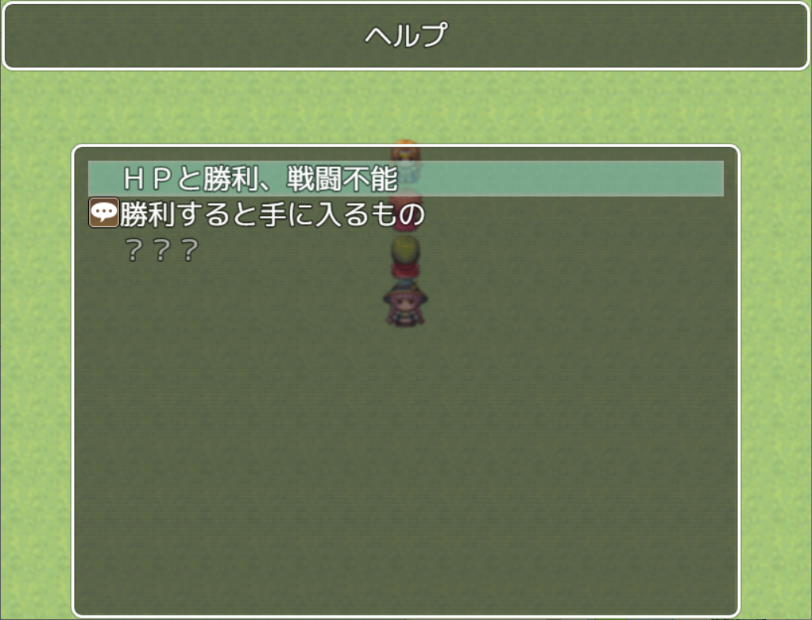
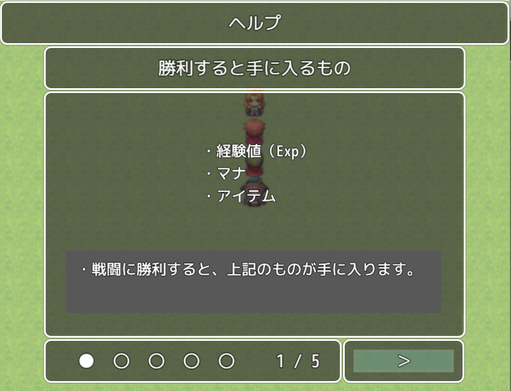
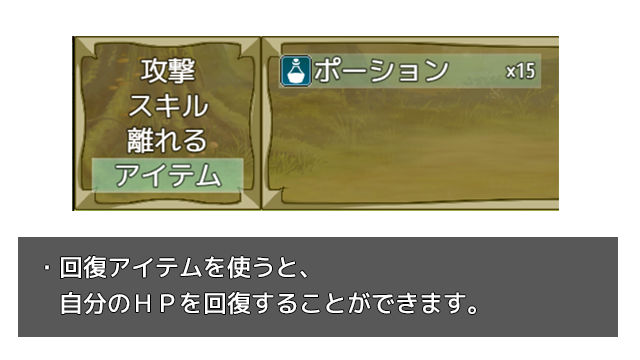



## 概要

チュートリアルで出てくるような、数枚の画像のヘルプを、  
①イベントで表示できるようにし、  
②メニューやイベントで、後で見返せるようにする  
プラグインです。  

### ■ヘルプ画像

ヘルプ画像（幅640px*高さ360px）。一つのヘルプに１～４枚程度表示することを想定しています。

## 作り方

### ■ヘルプの作成

１．ヘルプ画像を用意。img/picturesフォルダに格納します。  

（幅640px*高さ360px)  

２．プラグインパラメータでヘルプを設定。  

１つのヘルプにつき、  
①ヘルプ名  
②１枚以上の画像を設定できます。  

■プラグインコマンド

<dl>

  <dt>AB_Help Open</dt>

  <dd>ヘルプシーンを開きます。</dd>

  <dt>AB_Help Show 1</dt>

  <dd>ＩＤ１番のヘルプを表示します。</dd>

  <dd>※この後、勝手にヘルプリストに追加され、既読になります。</dd>

  <dt>AB_Help Add 1</dt>

  <dd>ＩＤ１番のヘルプをヘルプシーンのリストに追加します。</dd>

  <dt>AB_Help Remove 1</dt>

  <dd>ＩＤ１番のヘルプをヘルプシーンのリストから削除します。</dd>

  <dt>AB_Help Complete</dt>

  <dd>すべてのヘルプをヘルプシーンのリストに加えます。</dd>

  <dt>AB_Help Clear</dt>

  <dd>すべてのヘルプをヘルプシーンのリストから削除します。</dd>

</dl> 

## 更新履歴

### Version 1.00 公開
  

## 利用規約

MITライセンスです。
 - クレジット表記は不要
 - 営利目的で使用可
 - 改変可
	 - ただし、ソースコードのヘッダのライセンス表示は残してください。
 - 素材だけの再配布も可
 - アダルトゲーム、残酷なゲームでの使用も可

## License

MIT